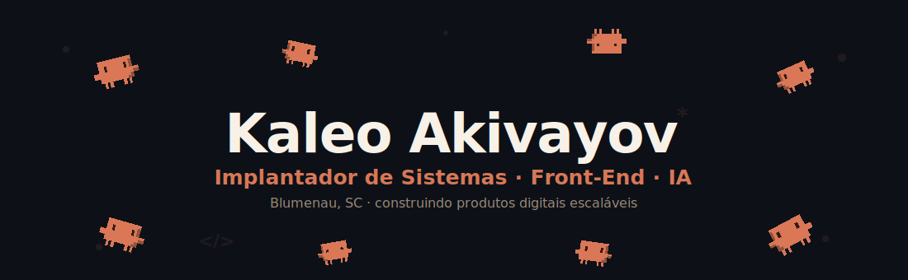

---

### 👋 Olá, seja bem-vindo(a) ao meu perfil!

Sou o **Kaleo**, 20 anos, **Implantador de Sistemas**.
Atuo com **implantação de projetos e customização de layout / front-end** para lojas de e-commerce — e nas horas vagas construo meus próprios **produtos digitais**.
Curto pegar uma ideia e levar até virar produto: do **layout** à **lógica**, com uma boa dose de **IA** no meio do caminho.

---

## 🚀 Sobre Mim

🔹 **20 anos**, de **Blumenau, SC**
🔹 **Implantador de Sistemas** — implantação de projetos + **layout e front-end** para e-commerce
🔹 Construo **produtos digitais próprios** (fintech gamificada, plataforma de leitura, SaaS)
🔹 Integro **IA / LLMs** em produtos reais e no meu fluxo de desenvolvimento
🔹 **Formado** em Análise e Desenvolvimento de Sistemas

---

## 🛠️ Tech Stack

### 🎨 Front-End & Layout

### 🔧 Back-End

### 🗄️ Banco de Dados & Infra

### 🤖 IA & Automação

> Integro **modelos de linguagem (LLMs)** em produtos reais — features com a **API da Anthropic (Claude)**, fluxos de desenvolvimento assistidos por IA e automações que aceleram a entrega. Uso IA como **parte do processo de engenharia**, não como enfeite.

### ⚙️ Ferramentas

---

## ⭐ Projeto em Destaque

### 🏙️ Controle Financeiro — finanças pessoais gamificadas

Um app onde a **sua vida financeira vira uma cidade em pixel art isométrico** (na pegada *Clash of Clans*). Cada categoria de receita/gasto **constrói e evolui estruturas** no vilarejo, e o hub central mostra o seu patrimônio total. Dois modos selecionáveis no onboarding: **dashboard clássico** para quem quer os números, e **vila gamificada** para quem acha app de finança chato demais.

**Stack:** `Next.js 15` · `TypeScript` · `TailwindCSS` · `PostgreSQL + Drizzle ORM` · `Auth.js`
**Status:** 🔒 em desenvolvimento (repositório privado)

🧩 Também construindo: <b>VayoToons</b> (plataforma de leitura de manhwa/mangá em PT-BR) e um <b>SaaS de agendamento</b> para salões e barbearias.

---

## 📊 Minhas Estatísticas

---

## 🎓 Formação

🎓 **Graduação:** Análise e Desenvolvimento de Sistemas — *UniSenai* · ✅ Concluído em **Jun/2026**
💻 **Bootcamp T-Academy — ProWay** · ✅ Concluído em **Out/2025**
📜 **Técnico em Análise e Desenvolvimento de Sistemas — Senai** · ✅ Concluído em **Dez/2023**

---

## 📫 Contatos

---

💬 *Aberto a trocar ideia sobre **produtos, front-end e IA** — chama!*
⭐ *Se curtir algum projeto, deixa uma estrela nos repositórios!*

